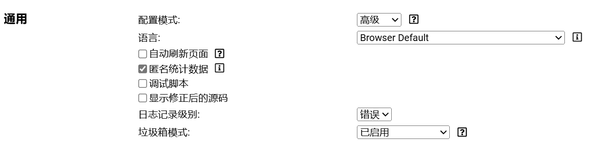
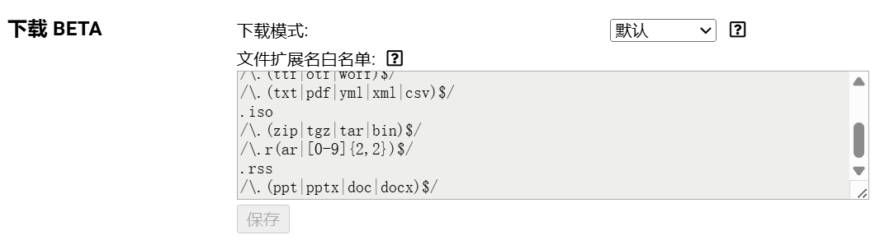

# Xiaoya Download

## 功能描述

小雅下载油猴脚本，支持下载Word、PDF、PPT文档。

## 使用方法

### 步骤 1: 添加脚本

将 `download.js` 添加到TamperMonkey用户脚本。

### 步骤 2: 配置TamperMonkey

1. 打开TamperMonkey的设置。
2. 将配置模式改为**高级**。
   

### 步骤 3: 设置文件扩展名白名单

1. 找到下载BETA设置。
2. 在文件扩展名白名单末尾加入一行 `/\.(ppt|pptx|doc|docx)$/`。
3. 保存设置。
   

### 步骤 4: 下载文档

1. 打开任意课程的Word、PDF、PPT文档。
2. 点击左上角脚本生成的下载资源按钮即可下载。
   